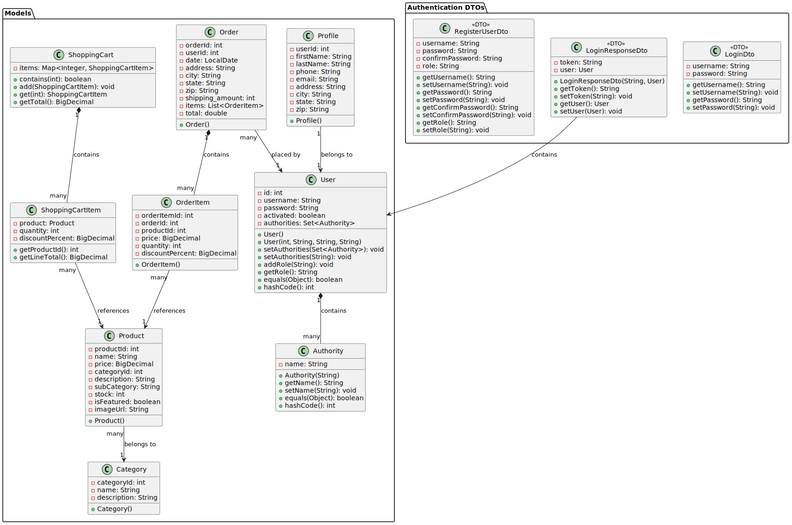
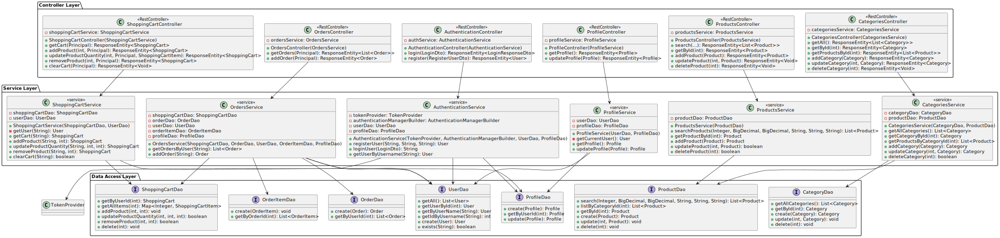
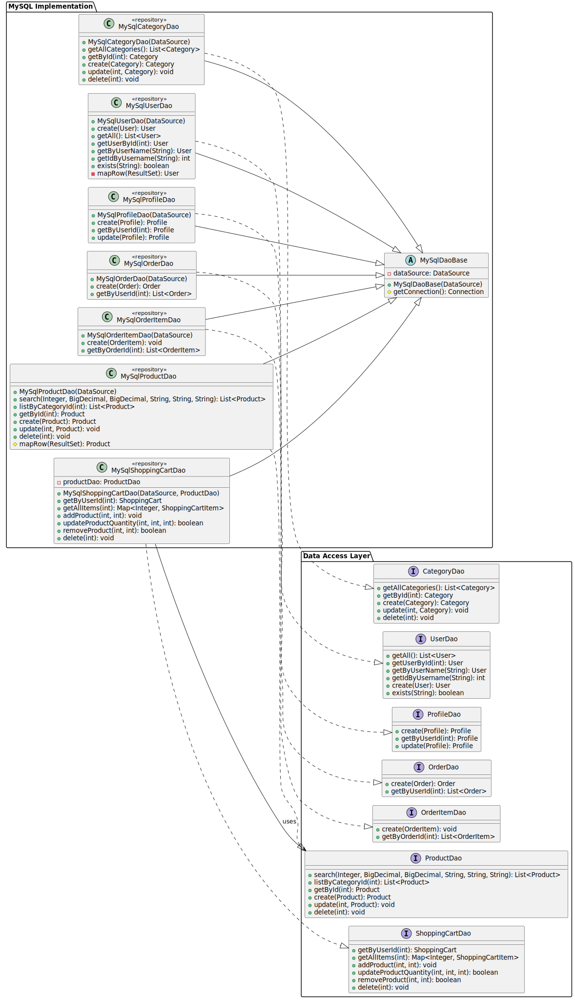
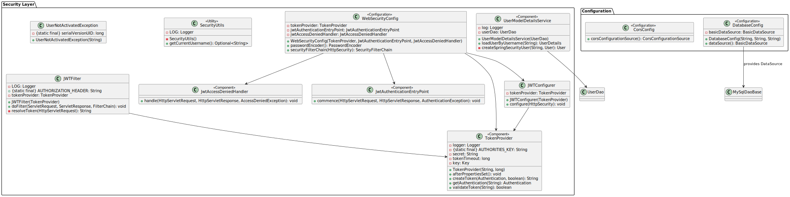

# 📌 The Record Shop 💽
A RESTful backend application for managing an online record shop, demonstrating clean architecture, secure authentication, and testable backend design using Java, Spring Boot, and MySQL.

This project was built to showcase backend engineering skills, RESTful API design, and real-world business logic such as shopping carts and order processing.

---

## 📚 Table of Contents

* [📘 Overview](#-overview)
* [🚀 Features](#-features)
* [🔌 API Endpoints](#-api-endpoints)
* [📐 Project Architecture](#-project-architecture)
* [🧩 UML Diagram](#-uml-diagram)
* [🏗️ Technical Features](#-technical-features)
* [▶️ Installation and Setup](#-installation-and-setup)
* [🎮 DEMO](#-demo)
* [👨‍💻 Author](#-author)

---

## 📘 Overview

The application consists of two primary parts:


1. **Spring Boot Backend** – provides RESTful APIs for authentication, product catalog management, shopping cart operations, order processing, and user profile management.
2. **[Frontend](https://github.com/vita-sych/RecordShop-Client)** – offers a responsive user interface for user authentication, profile management, browsing records, customizing orders, and checkout.

---
## 🚀 Features

### **1. Authentication & User Accounts**
- ✅ User Registration – Create new user accounts with role-based access
- ✅ Secure Login – JWT-based authentication
- ✅ Role Management – Support for Admin and Customer roles
- ✅ Protected Endpoints – Secure access to orders, cart, and profile data

### **2. Product Catalog & Browsing**
- ✅ Browse Products – View all available records
- ✅ Product Details – Retrieve full product information by ID
- ✅ Category Browsing – View products grouped by category
- ✅ Advanced Search & Filters
- ⚙️ Filter by category
- ⚙️ Filter by sub-category
- ⚙️ Filter by price range
- ⚙️ Search by product name
- ⚙️ Sorting – Sort products by price (Low → High, High → Low)

### **3. Shopping Cart Management**
- ✅ Create Cart Automatically – Cart is created per authenticated user
- ✅ Add Products to Cart – Add items by product ID
- ✅ Update Quantities – Increase or decrease item quantity
- ✅ Remove Items – Delete individual products from the cart
- ✅ Clear Cart – Remove all items at once
- ⚙️ Persistent Cart – Cart state stored in the database

### **4. Order Management**
- ✅ Create Orders from Cart – Convert cart items into an order
- ✅ Order Line Items – Each product stored with quantity and price
- ✅ Order History – Retrieve all orders for the authenticated user
- ✅ Order Details – View items, totals, and order metadata
- ⚙️ Automatic Total Calculation – Based on item price × quantity
- ⚙️ Shipping Calculation – Derived from total item quantity

### **5. Profile Management**
- ✅ View Profile – Retrieve user profile details
- ✅ Edit Profile – Update address and contact information
- ⚙️ Profile Auto-Creation – Created automatically on registration

### **8. Admin Management (Role-Based)**
- ✅ Product Management 
  - Add new products
  - Update existing products
  - Delete products
- ✅ Category Management
  - Create categories
  - Update category information
  - Remove categories
- ⚙️ Restricted Access – Admin-only endpoints secured with Spring Security

### **7. Checkout & Order Finalization**
- ✅ Checkout Flow – Finalize an order from the shopping cart
- ✅ Order Persistence – Orders and line items saved atomically
- ⚙️ Cart Cleanup – Cart is cleared after successful checkout
- ⚙️ Order Confirmation Data – Returned to the client after checkout

**Receipt Example:**


---
## 🔌 API Endpoints

| Method        | Endpoint                     | Description                                                                             |
| ------------- | ---------------------------- | --------------------------------------------------------------------------------------- |
| 🟡 **POST**   | `/login`                     | Authenticate user and return JWT token                                                  |
| 🟡 **POST**   | `/register`                  | Register a new user                                                                     |
| 🟢 **GET**    | `/profile`                   | Retrieve authenticated user's profile                                                   |
| 🟡 **PUT**    | `/profile`                   | Update authenticated user's profile                                                     |
| 🟢 **GET**    | `/categories`                | Retrieve all categories                                                                 |
| 🟢 **GET**    | `/categories/{id}`           | Retrieve a category by ID                                                               |
| 🟢 **GET**    | `/categories/{id}/products`  | Retrieve all products under a specific category                                         |
| 🟡 **POST**   | `/categories`                | Add a new category (Admin only)                                                         |
| 🟢 **GET**    | `/products`                  | Retrieve all products with optional filters (category, price, subcategory, name, order) |
| 🟢 **GET**    | `/products/{id}`             | Retrieve a product by ID                                                                |
| 🟡 **POST**   | `/products`                  | Add a new product (Admin only)                                                          |
| 🟡 **PUT**    | `/products/{id}`             | Update a product (Admin only)                                                           |
| 🔴 **DELETE** | `/products/{id}`             | Delete a product (Admin only)                                                           |
| 🟢 **GET**    | `/cart`                      | Retrieve authenticated user's shopping cart                                             |
| 🟡 **POST**   | `/cart/products/{productId}` | Add a product to the shopping cart                                                      |
| 🟡 **PUT**    | `/cart/products/{productId}` | Update quantity of a product in the cart                                                |
| 🔴 **DELETE** | `/cart/products/{productId}` | Remove a product from the cart                                                          |
| 🔴 **DELETE** | `/cart`                      | Clear the shopping cart                                                                 |
| 🟢 **GET**    | `/orders`                    | Retrieve authenticated user's orders                                                    |
| 🟡 **POST**   | `/orders`                    | Create a new order from the shopping cart                                               |

---
## 📐 Project Architecture


The architecture follows the Repository Pattern and Dependency Injection principles typical of Spring Boot applications, with clear separation of concerns between controllers, services, and data access layers.

*React Frontend* – handles the user interface and client-side logic.

*Spring Boot Backend* – exposes RESTful APIs that handle data retrieval, order processing, and receipt generation.

Communication between these two parts occurs over HTTP using REST APIs with JSON payloads.

---
## 🧩 UML Diagram

**Model**



**Controller → Service → DAO**



**MySQL**



**Security**



### 1. Layered Architecture

The project follows a layered architecture (commonly called 3-tier architecture) for separation of concerns:

**Controller Layer (API Layer)**
- Handles incoming HTTP requests.
- Maps RESTful endpoints to service methods.
- Validates input and returns appropriate HTTP responses.

**Service Layer (Business Logic Layer)**
- Contains the core business logic.
- Coordinates between DAOs/repositories and controllers.
- Handles transactional operations like order creation, profile updates, cart management.

**DAO Layer (Data Access Layer)**
- Interacts with the database.
- Performs CRUD operations on entities like Product, Category, Order, User, Profile, ShoppingCart.
- Uses JDBC (via DataSource) for MySQL queries.

**Model Layer (Domain Layer)**
- Represents the data structures: Product, Category, Order, OrderItem, Profile, ShoppingCart, User.
- Includes DTOs for authentication (LoginDto, RegisterUserDto) and responses.

### 2. Database Layer
- MySQL: Stores all persistent data, including products, categories, orders, and users.
- Uses DAO implementations (MySqlCategoryDao, MySqlProductDao, etc.) to interact with the database.

### 3. Security

**Spring Security + JWT**
- Provides authentication (/login) and authorization.
- Role-based access control (e.g., ADMIN for managing products/categories).
- Secures endpoints for authenticated users.

### 4. Frontend 
- Responsive UI for user login, profile editing, browsing products, managing cart, customizing orders, and checkout.
- Consumes RESTful APIs exposed by the backend.

---
## 🏗️ **Technical Features**

### **Architecture Pattern**
- ✅ **Layered Architecture** - Controller → Service → DAO → Database
- ✅ **Repository Pattern** - Abstracts data access logic through DAOs
- ✅ **Dependency Injection** - Spring-managed beans using @Component, @Autowired, and DataSource injection
- ✅ **RESTful API** - Standard HTTP methods and endpoints for client-server communication
- ✅ **Exception Handling** – Handles errors directly in controllers or services using ResponseStatusException

### **Data Models**
- ✅ **Lombok Integration** - Reduces boilerplate code for getters, setters, constructors, and builders
- ✅ **Builder Pattern** - Enables convenient and readable object creation
- ✅ **Entity Interfaces** - Supports polymorphic behavior and code reuse for different entities

### **Key Features**
- ✅ **MySQL Integration** – Efficient database interactions using JDBC and DAOs
- ✅ **Spring Boot Framework** – Simplified configuration, dependency management, and REST support
- ✅ **Unit-Test Friendly** – Components are loosely coupled, making them easy to test with mocks
- ✅ **Scalable Design** – Layered architecture allows for future expansion and modular development
- ✅ **Global CORS Setup** - Configured via CorsConfig class for the entire application

---

## ▶️ **Installation and Setup**

⚙️ Configuration

 *application.properties*
```
datasource.url=jdbc:mysql://localhost:3306/recordshop
datasource.username=root
datasource.password=your_password
````
⚠️ Make sure MySQL is running and the database exists before starting the app.

1. **Clone the repository**
   ```bash 
    git clone git@github.com:vita-sych/RecordShop-Server.git
   ```
   ```bash 
   cd RecordShop-Server
   ```

2. **Configure and Start Backend**

   Build the project using Maven:
    ```bash 
      mvn clean install
    ```

   Run the Spring Boot application:
    ```bash 
      mvn spring-boot:run
    ```

   The backend will be available at:
    ```bash 
      http://localhost:8080
    ```
3. **Configure and Start Frontend**
    ```bash 
    git clone git@github.com:vita-sych/RecordShop-Client.git
    ```
   ```bash 
   cd RecordShop-Client
   ```
   The frontend will open at:
    ```bash 
    http://localhost:52330
    ```
4. 🧪 **Testing**
    ```bash 
    mvn test
    ```

---
### 🎮 DEMO

[Project DEMO](https://youtu.be/liz_5dvFUCs)

---
### 👩‍💻 Author
Vita Sych - [LinkedIn](https://www.linkedin.com/in/vita-sych/)